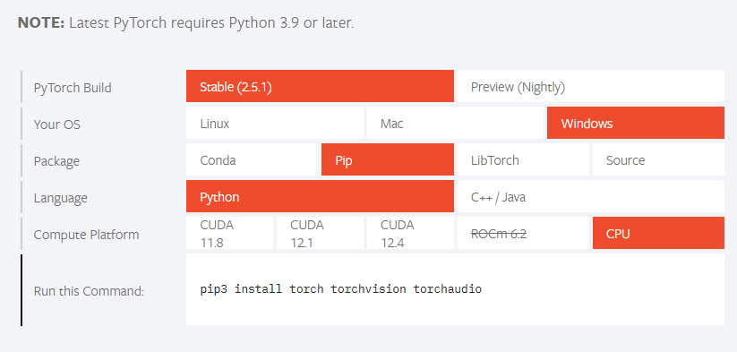
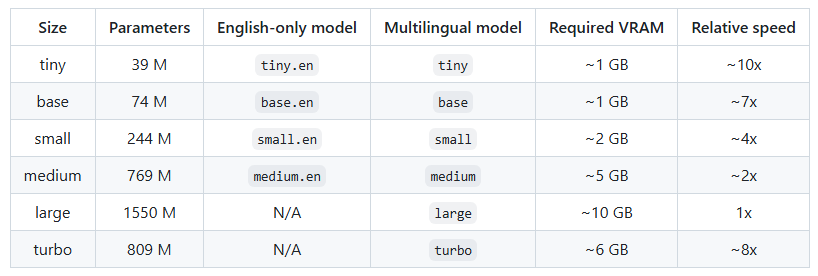

# Transcriber

## Descrição

Transcriber é uma API Python para transcrição de áudios em texto através de inteligência artificial. Ele permite que você converta arquivos de áudio em texto com alta precisão, podendo ser integrado facilmente a outras aplicações.

Este projeto é útil para desenvolvedores que desejam incorporar em suas aplicações funcionalidades que exigem a transcrição de áudio. É ideal para criar recursos como assistentes virtuais, ferramentas de acessibilidade, análise de gravações e outras soluções que exigem a conversão de áudio em texto.

## Endpoint da API

### `POST /transcrever`
**Descrição:** Retorna a transcrição do áudio enviado para a API.

**Método:** `POST`

**Endereço:**
```bash
http://localhost:5000/transcrever
```

## Como rodar o projeto

1 - Configure o seu ambiente virtual para utilizar o Python 3.9.+.

2 - Instale o PyTorch correto para o seu caso. Como descrito no site https://pytorch.org:



3 - Instale o ffmpeg no seu sistema operacional. Para isso você pode utilizar:

No Ubuntu ou Debian
```bash
$ sudo apt update && sudo apt install ffmpeg
```

No Arch Linux
```bash
$ sudo pacman -S ffmpeg
```

No MacOS com Homebrew (https://brew.sh/)
```bash
$ brew install ffmpeg
```

No Windows com Chocolatey (https://chocolatey.org/)
```bash
$ choco install ffmpeg
```

No Windows com Scoop (https://scoop.sh/)
```bash
$ scoop install ffmpeg
```

4 - Instale o Flask:
```bash
pip install Flask==3.1.0
```

5 - E por fim instale o Whisper da OpenAI, que vai ser o responsável pela transcrição dos áudios:
```bash
pip install -U openai-whisper
```

Para mais informações sobre o Whisper, você pode acessar o repositório oficial dele: https://github.com/openai/whisper

## Notas

Por esse projeto, o transcriber, se tratar de um projeto open source, você pode modificar o código e ajustá-lo para as suas necessidades, inclusive, você pode definir via código o modelo que você deseja utilizar como mostrado nessa tabela abaixo presente no repositório oficial do Whisper:


Para o transcriber, utilizei o modelo no tamanho “small”, e ele se saiu bem nas transcrições, no entanto, se sinta à vontade para trocar por algum outro tamanho que venha a atender às suas necessidades

## Licença
Este projeto está licenciado sob a Licença MIT - veja o arquivo [LICENSE](LICENSE) para mais detalhes.